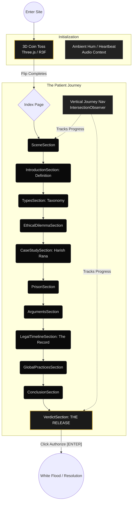

# Euthanasia: An Interrogation of Mercy

<div align="center">
  <h3>An Interactive Case Study on Euthanasia in India</h3>
  <p>Exploring the ethical dilemma, the legal record, and the tragedy of Harish Rana.</p>
</div>

---

## 📖 Overview

**The Void Dialogue** is a highly immersive, interactive web experience built to explore the complex ethics and legal standing of euthanasia in India. Through a dramatic, dark-themed UI, the project presents the devastating case of Harish Rana (2013–2026), interrogating the boundaries between forcing existence and authorizing mercy.

The application uses scroll-triggered animations to guide users through the definitions, arguments, and final verdict of passive euthanasia, culminating in a striking interactive conclusion.

## ✨ Features

- **3D Interactive Preloader:** A Three.js powered interactive coin toss. Users can drag to inspect both sides of the coin ("Continue Living" vs. "End the Suffering") before committing to the experience with a realistic 3D flip animation.
- **Scroll-Driven Storytelling:** Smooth, cinematic transitions as the user scrolls, utilizing Framer Motion for text reveals, parallax effects, and background color shifts.
- **Ambient Audio Landscape:** A subtle, clinical heartbeat monitor sound effect that grounds the user in the hospital room setting.
- **Patient Journey Navigation:** A custom, fixed vertical progress tracker that highlights the user’s current position within the narrative.
- **Responsive "Cinematic" Design:** A stark, minimalist dark theme using Tailwind CSS and shadcn/ui components, optimized for both desktop and mobile viewing.

---

## 🏗️ Architecture & Component Flow

The application follows a strictly linear, chapter-based component structure integrated into a single main page layout.



---

## 💻 Tech Stack

- **Framework:** [React 18](https://react.dev/)
- **Build Tool:** [Vite](https://vitejs.dev/)
- **Language:** [TypeScript](https://www.typescriptlang.org/)
- **3D Rendering:** [Three.js](https://threejs.org/) + [@react-three/fiber](https://docs.pmnd.rs/react-three-fiber/getting-started/introduction) + [@react-three/drei](https://github.com/pmndrs/drei)
- **Animations:** [Framer Motion](https://www.framer.com/motion/)
- **Styling:** [Tailwind CSS](https://tailwindcss.com/)
- **UI Components:** [shadcn/ui](https://ui.shadcn.com/)

---

## 🚀 Running Locally

Follow these steps to run the experience on your local machine:

### 1. Clone the repository
```sh
git clone <YOUR_GIT_URL>
cd scroll-void-dialogue
```

### 2. Install dependencies
*Note: Make sure you are using a Node version compatible with React 18.*
```sh
npm install
```

### 3. Start the development server
```sh
npm run dev
```

### 4. Open in browser
Navigate to `http://localhost:8080` (or the port specified in your terminal) to experience the narrative.

---

## 📜 Disclaimer

The narrative and case study presented reflect real-world legal and ethical debates surrounding euthanasia in India. The "Release" interactive sequence at the end is a creative metaphor for dramatic effect.
